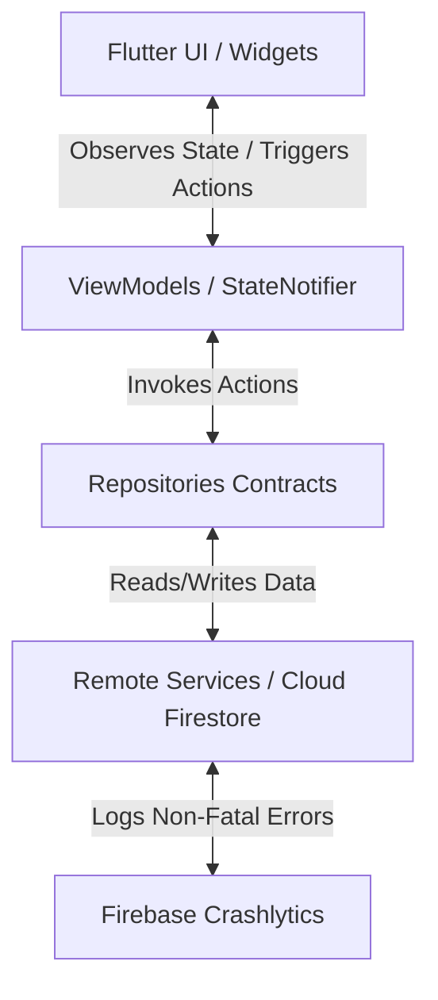
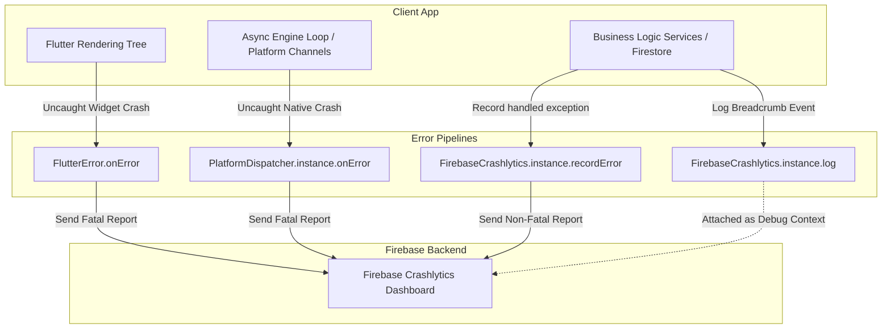

# Act For Earth 🌍 - Technical Documentation Manual

Act For Earth is a gamified, feature-rich Flutter habit tracker designed to encourage, guide, and reward users for performing eco-friendly actions. This document serves as a complete technical guide to the application's architecture, data models, logic formulas, and exception reporting pipeline.

---

## 📂 Project Directory Structure

```text
lib/
├── app/
│   └── app.dart                                # Global MaterialApp & multi-repository initialization
├── data/
│   ├── remote/
│   │   ├── ai_suggestion_firestore_service.dart # AI suggestions collection interactions
│   │   ├── challenge_firestore_service.dart     # General green challenges database seeding/fetching
│   │   ├── firebase_auth_service.dart           # Authentication & Auth Crashlytics logging
│   │   ├── habit_log_firestore_service.dart     # History and logger transactions
│   │   ├── habit_remote_datasource.dart        # Core habits CRUD & Firestore logging
│   │   ├── leaderboard_firestore_service.dart   # Rankings, points sync & seeding
│   │   ├── llm_service.dart                     # Gemini AI API wrapper & error logging
│   │   ├── notification_service.dart            # Native local notifications (v22 API)
│   │   ├── reward_firestore_service.dart        # Points, milestones, and badge unlocks
│   │   ├── user_challenge_firestore_service.dart # Challenge opt-in & status checks
│   │   └── user_firestore_service.dart          # Profiles metadata management
│   └── repository/
│       ├── auth_repository_impl.dart
│       └── habit_repository_impl.dart
├── domain/
│   ├── model/                                  # Data Entities / Models
│   │   ├── ai_suggestion.dart
│   │   ├── challenge.dart
│   │   ├── habit.dart
│   │   ├── leaderboard_entry.dart
│   │   ├── user_model.dart
│   │   └── user_reward.dart
│   └── repository/                             # Abstract contract definitions
│       ├── auth_repository.dart
│       └── habit_repository.dart
├── main.dart                                   # Main entry point; binds Crashlytics pipelines
└── ui/                                         # User Interface / Presentation Layer
    ├── auth/                                   # Login, registration, and email validations
    ├── challenge/                              # Public ecological challenges checklists
    ├── habit_list/                             # Core dashboard tracker screen
    │   ├── habit_list_screen.dart              # Filtering, checklist widgets, and card layouts
    │   ├── habit_list_viewmodel.dart           # Streak math, notification scheduling triggers
    │   └── widgets/
    │       ├── add_habit_dialog.dart           # Dynamic category selector & Target Frequency inputs
    │       └── habit_calendar_history.dart     # Insights bottom sheet (Monthly calendar grid)
    ├── leaderboard/                            # Top Eco Champions rankings
    ├── profile/                                # Badges, statistics, and dev test page
    │   ├── crashlytics_test_page.dart          # Test-once error & native crash triggers
    │   └── profile_screen.dart                 # Account details, passwords, actions loading
    └── widgets/                                # Resusable styling elements
```

---

## 🏛️ Architecture & View-Model Data Flow

The application follows the **MVVM (Model-View-ViewModel)** architectural pattern:



### 1. Presentation Layer (`lib/ui`)
*   **UI Views** are structured as `Stateful` or `Stateless` widgets. Views do not query services directly.
*   **ViewModels** manage view state using reactive notifier constructs, abstracting business rules away from the render trees.

### 2. Domain Layer (`lib/domain`)
*   Contains pure domain models (e.g., [habit.dart](lib/domain/model/habit.dart), [user_reward.dart](lib/domain/model/user_reward.dart)) and abstract repository definitions. This keeps core rules decoupled from databases.

### 3. Data Layer (`lib/data`)
*   Implements repositories mapping data queries into remote backend engines (Cloud Firestore, Firebase Auth, Local Notification System).

---

## ⚙️ Core Modules & Logic Formulations

### 1. Today-Only Habit Logging
To reinforce daily routine checks and prevent retrospect editing:
*   The habit calendar row renders the current week's days (Monday through Sunday).
*   The logger validates if the tapped day is equal to `DateTime.now()` (timezone normalized to `12:00:00.000` to prevent hour/minute offsets).
*   If the selected date is not today, the action is blocked, and the screen triggers a custom Material SnackBar indicating:
    > *"You can only log completions for today!"*
*   Non-active days are rendered with reduced opacity (`0.4`), showing a visual lock icon when appropriate.

---

### 2. Gamified Streak Calculations
Streaks are processed inside [habit_list_viewmodel.dart](lib/ui/habit_list/habit_list_viewmodel.dart). The calculation splits habits into two branches based on target frequency:

#### A. Daily Streak Algorithm (Target Frequency $\ge$ 7 days per week)
Measures consecutive calendar days logged.
1.  Extract completed dates in ascending order.
2.  Normalize dates to midnight.
3.  Check backwards starting from "Today" or "Yesterday":
    *   If yesterday or today is not logged, the current streak is `0`.
    *   Iterate backwards: if $Date_{i-1}$ is exactly 1 day prior to $Date_{i}$, increment streak counter.
    *   If a gap of $\ge 2$ days is encountered, the count stops.

#### B. Weekly Streak Algorithm (Target Frequency < 7 days per week)
Measures consecutive successful weeks. A week is defined from Monday to Sunday.
1.  Group completions by Monday-to-Sunday calendar weeks.
2.  For any completed week, check if `completionsInWeek.length >= targetFrequency`. If yes, that week is marked **Successful**.
3.  **Active Week Check**:
    *   During the current week (from Monday to today), check if the target has been met.
    *   If the target has *not yet* been met, determine if it is still mathematically reachable:
        $$\text{Current Completions} + \text{Remaining Days of Week} \ge \text{Target Frequency}$$
    *   If reachable, the active streak is preserved. If unreachable, the streak reset occurs.
4.  Iterate backwards week-by-week. If a week failed to meet the target (and was not mathematically salvageable), stop counting.

---

### 3. EcoPoints & Badge Milestones
Managed by `RewardFirestoreService` ([reward_firestore_service.dart](lib/data/remote/reward_firestore_service.dart)):
*   **Base Reward**: `+10 EcoPoints` per logged daily target.
*   **Daily Streak Multiplier**: `+5 EcoPoints` bonus per day of the active streak.
*   **Weekly Streak Multiplier**: `+15 EcoPoints` bonus upon reaching the weekly frequency target.
*   **Anti-Farming Point Deductions**: When a user un-checks a task, the points (base + bonuses) earned for that entry are calculated and subtracted from the user's score to protect the rewards store.
*   **Badge Thresholds**:
    *   `50 Points` $\rightarrow$ Unlocks **Green Pioneer**
    *   `100 Points` $\rightarrow$ Unlocks **Eco Hero**
    *   `200 Points` $\rightarrow$ Unlocks **Eco Guardian**

---

### 4. Local Notification Scheduling (v22 API Compliant)
Native alarms configured in [notification_service.dart](lib/data/remote/notification_service.dart):
*   **Reminders**: Whenever a habit is created or edited, a recurring daily notification is scheduled via `periodicallyShow(...)`.
    *   **Named Parameters Configuration**:
        ```dart
        await _notificationsPlugin.periodicallyShow(
          id: id,
          title: title,
          body: body,
          repeatInterval: RepeatInterval.daily,
          notificationDetails: details,
          androidScheduleMode: AndroidScheduleMode.exactAllowWhileIdle,
        );
        ```
*   **Cleanups**: Toggling a deletion cancels the associated scheduler channel using `cancelNotification(id)`.
*   **Congratulations Alerts**: Standard native channel notifications are instantly shown when a badge threshold is crossed.

---

### 5. Gemini AI Suggestions
*   Queries `gemini-2.5-flash` to analyze active user habits and recent log counts.
*   The prompt compiles a formatted list of recent logs and asks for exactly three simple, non-redundant green steps returning as plain strings.
*   Falls back to pre-coded suggestions if network fails, or if `GEMINI_API_KEY` environment setup is skipped.

---

## 🛡️ Exception Handling & Firebase Crashlytics Architecture

The error-catching infrastructure is structured into two main tiers: **Uncaught Engine Interceptors** (which catch fatal application crashes) and **Predictable Business Logic Handlers** (which capture handled network, API, or permission failures without stopping the user's flow).



---

### 1. Global Interceptors (Uncaught Fatal Errors)
*   **File**: [main.dart](lib/main.dart#L19-L29)
*   **Purpose**: Intercepts unhandled app exceptions before the runtime terminates.
*   **Code Details**:
    *   `FlutterError.onError`: Captures errors thrown by the Flutter framework during widget rendering/layout and redirects them to `FirebaseCrashlytics.instance.recordFlutterFatalError`.
    *   `PlatformDispatcher.instance.onError`: Binds to the engine loop to capture asynchronous native/platform-channel exceptions and records them as fatal errors.

---

### 2. Business Logic Error Catchers (Handled Non-Fatal Exceptions)
We use a **"Wide Net"** exception monitoring pattern: wrapping external operations in try-catch statements, logging informational event details via `FirebaseCrashlytics.instance.log`, and reporting caught exceptions as non-fatal events via `FirebaseCrashlytics.instance.recordError`.

*   **Authentication (Sign Up / Sign In)**:
    *   **File**: [firebase_auth_service.dart](lib/data/remote/firebase_auth_service.dart#L15-L38)
    *   **Implementation**: Records `FirebaseAuthException` details, attaching email and error code to debug logs prior to reporting the failure.
*   **User Profiles Management**:
    *   **File**: [user_firestore_service.dart](lib/data/remote/user_firestore_service.dart#L15-L69)
    *   **Implementation**: Logs targeted user ID keys and records database timeout or permission errors during profile mutations and stream reads.
*   **Gemini AI Suggestions**:
    *   **File**: [llm_service.dart](lib/data/remote/llm_service.dart#L56-L63)
    *   **Implementation**: Reports connection failures or model issues, appending whether the API Key was empty as context.
*   **Permissions System**:
    *   **File**: [notification_service.dart](lib/data/remote/notification_service.dart#L28-L41)
    *   **Implementation**: Logs when notifications permission is denied by the user, and captures exceptions thrown by the system permissions framework.
*   **Habits Tracking Database**:
    *   **File**: [habit_remote_datasource.dart](lib/data/remote/habit_remote_datasource.dart#L24-L65)
    *   **Implementation**: Binds streams and write requests to capture Firestore database failures.
*   **Rewards & Leaderboard Services**:
    *   **Files**: [reward_firestore_service.dart](lib/data/remote/reward_firestore_service.dart#L18-L53) & [leaderboard_firestore_service.dart](lib/data/remote/leaderboard_firestore_service.dart#L26-L70)
    *   **Implementation**: Catches and logs point-saving transaction failures and rankings synchronization updates.

---

### 3. Developer Crash-Testing Hub
*   **File**: [crashlytics_test_page.dart](lib/ui/profile/crashlytics_test_page.dart#L47-L88)
*   **Purpose**: Provides a sandbox interface to test exception capturing in real-time.
*   **Safe Single-Trigger Logic**: Converting the page to a stateful widget allows us to toggle `_exceptionTriggered = true` or `_crashTriggered = true` immediately when a test button is tapped, instantly disabling the interface buttons. This stops rapid tap execution loops from causing nested crash loops or duplicate logs.

---

## 🗄️ Database Schemas (Cloud Firestore)

The system relies on five collection namespaces:

### 1. `users`
Stores user profile registrations.
```json
{
  "id": "String (Auth UID)",
  "email": "String",
  "displayName": "String",
  "createdAt": "Timestamp"
}
```

### 2. `habits`
Stores habit definitions and completed date logs.
```json
{
  "habitId": "String",
  "userId": "String",
  "title": "String",
  "category": "String (Energy | Waste | Water | Transportation | Food | Other)",
  "targetFrequency": "Integer (1-7)",
  "createdAt": "Timestamp",
  "completionDates": "Array of Timestamps (Normalized to midnight)"
}
```

### 3. `rewards`
Tracks progress gamification.
```json
{
  "userId": "String",
  "points": "Integer",
  "badges": "Array of Strings"
}
```

### 4. `leaderboard_entries`
Syncs ranking score boards.
```json
{
  "name": "String",
  "points": "Integer",
  "isCurrentUser": "Boolean"
}
```

### 5. `daily_quest_generations`
Logs Gemini AI calls limiting requests.
```json
{
  "userId": "String",
  "date": "String (YYYY-MM-DD)",
  "generatedAt": "Timestamp"
}
```

---

## 🚀 How to Run the App

1.  **Configure Firebase**:
    Initialize Firebase configuration file inside your project root using FlutterFire CLI:
    ```bash
    flutterfire configure
    ```
2.  **Launch with Gemini Key**:
    To enable daily green quest recommendations:
    ```bash
    flutter run --dart-define=GEMINI_API_KEY='YOUR_REAL_API_KEY'
    ```
3.  **Run Static Checks**:
    Ensure the code meets requirements and analyzes successfully:
    ```bash
    flutter analyze
    ```
